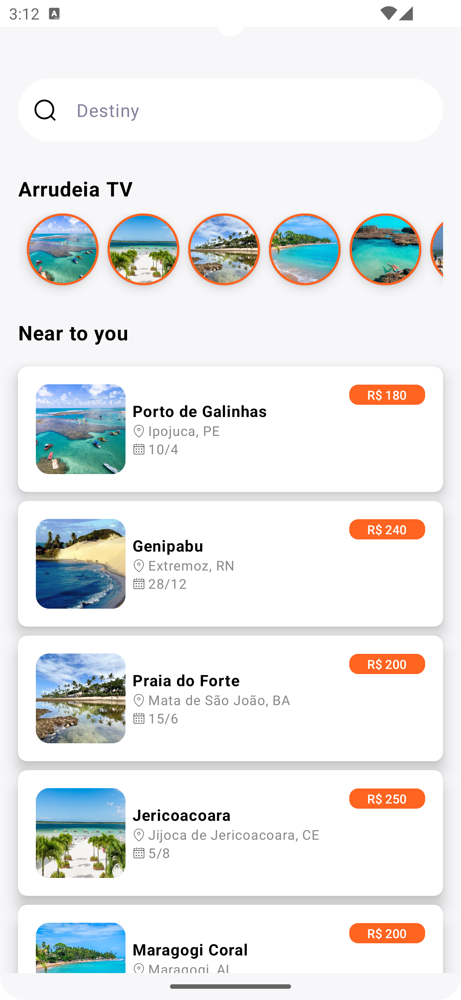

| O Arrudeia is a travel app made by tourists for tourists.  It offers discounts on trips, a map with locations reviewed by other travelers, quick and cheap recipes, as well as first aid tips to ensure a more convenient, economical, and safe travel experience. | [Download](https://play.google.com/apps/internaltest/4701533423351218713) |
| :-------------|:-------------:|

| Schema                                                 | Project       | Kanban | Documentation | 
| ------------------------------------------------------ |:-------------|:-------------:|:-------------:|
|      | Kotlin Jetpack GraphQl Compose Continuous Integration (CI/CD) Jacoco Detekt Unit Test| [Kanban](https://github.com/users/MarcosEduardoJr/projects/1) | [Documentation](https://github.com/MarcosEduardoJr/Arrudeia/wiki) | 

 

 </img>
 </img>
 </img>
 </img>
 </img>
 
